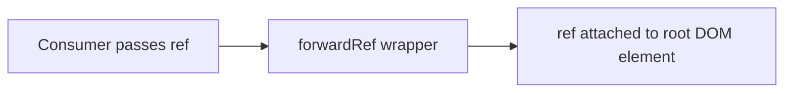
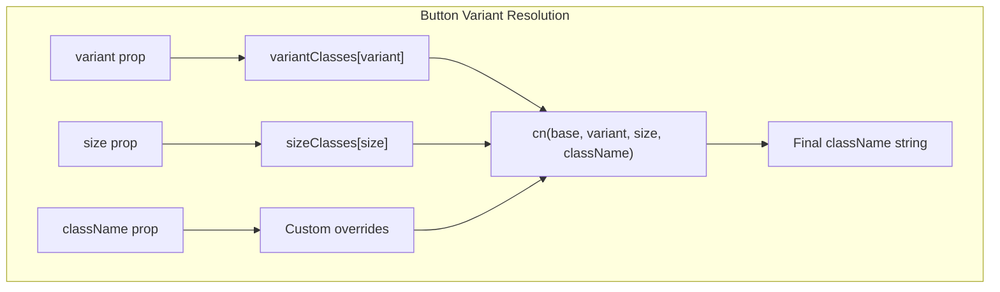
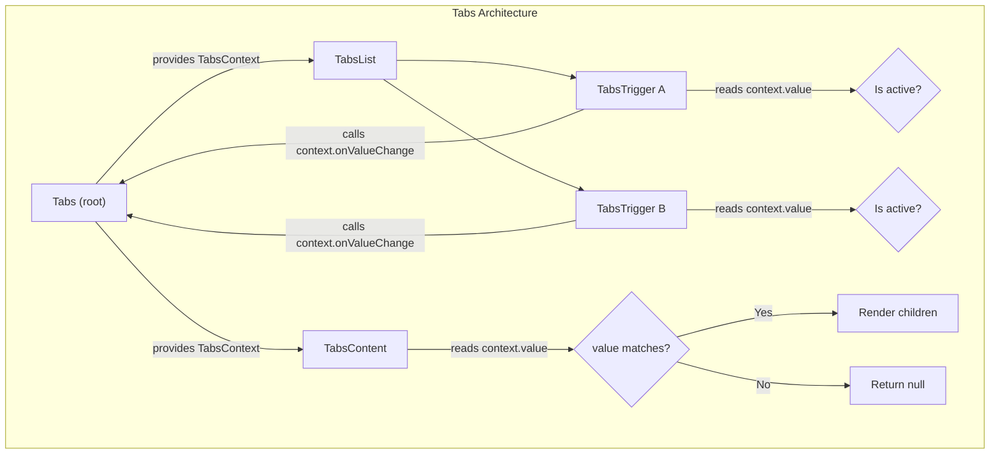
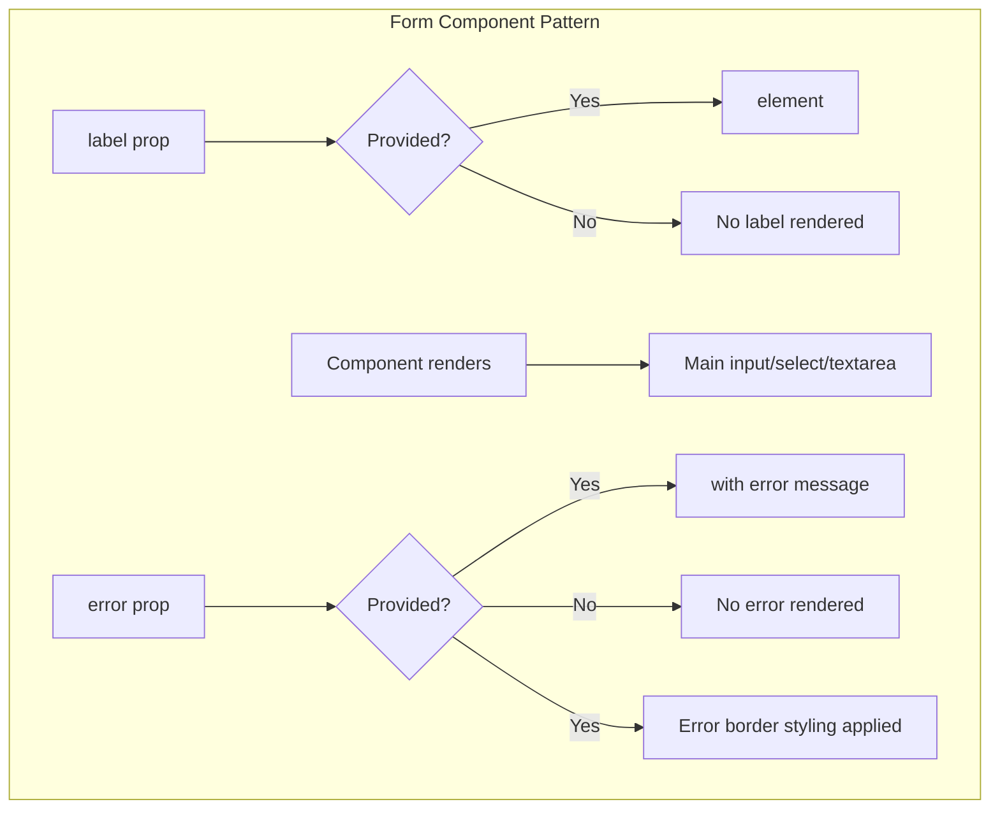
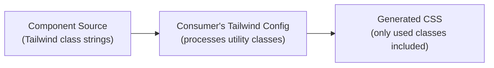
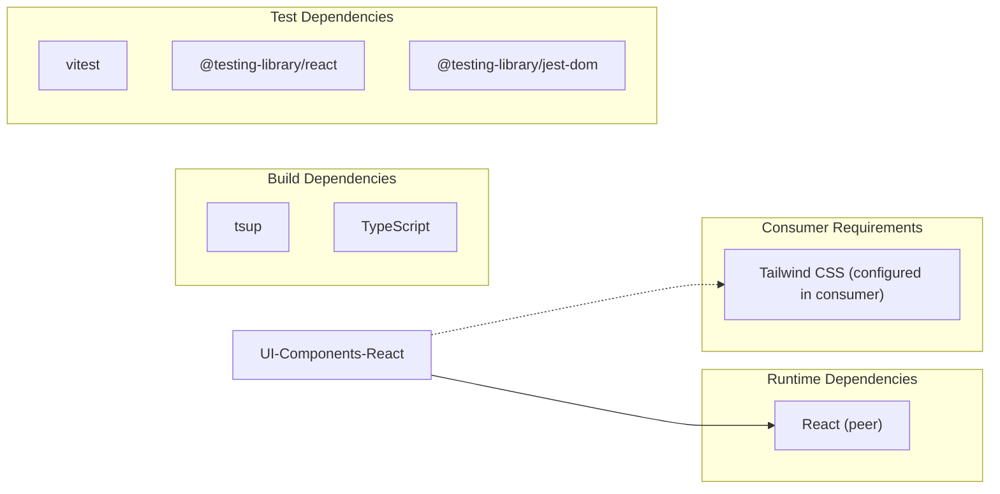

# UI-Components-React Architecture

## Overview

UI-Components-React is a standalone React component library built with TypeScript and Tailwind CSS utility classes. It provides reusable, composable, and accessible UI primitives with zero runtime dependencies beyond React (peer dependency). All styling is achieved through Tailwind CSS utility strings, meaning consumers must have Tailwind CSS configured in their project.

## Module Structure

```
src/
  components/
    Badge.tsx       -- Status/label badge with variant styles
    Button.tsx      -- Action button with variants, sizes, and loading state
    Card.tsx        -- Composable card container with sub-components
    Input.tsx       -- Text input with label, error, and icon support
    Progress.tsx    -- Progress bar with optional percentage label
    Select.tsx      -- Dropdown select with options array or children
    Switch.tsx      -- Toggle switch with accessible role="switch"
    Tabs.tsx        -- Tabbed content with context-based state management
    Textarea.tsx    -- Multi-line text input with label and error support
  lib/
    utils.ts        -- cn() class name merge utility
  __tests__/        -- vitest + @testing-library/react test suites
  index.ts          -- Barrel re-export of all components and types
```

## Component Hierarchy

```mermaid
graph TD
    subgraph "Library Exports"
        INDEX[index.ts -- barrel export]
    end

    subgraph "Utility Layer"
        CN["cn() -- class name merger"]
    end

    subgraph "Primitive Components"
        BUTTON[Button]
        INPUT[Input]
        BADGE[Badge]
        SELECT[Select]
        SWITCH[Switch]
        PROGRESS[Progress]
        TEXTAREA[Textarea]
    end

    subgraph "Composite Components"
        CARD[Card]
        CARD_HEADER[CardHeader]
        CARD_TITLE[CardTitle]
        CARD_DESC[CardDescription]
        CARD_CONTENT[CardContent]
        CARD_FOOTER[CardFooter]

        TABS[Tabs -- root + context provider]
        TABS_LIST[TabsList]
        TABS_TRIGGER[TabsTrigger]
        TABS_CONTENT[TabsContent]
    end

    INDEX --> BUTTON
    INDEX --> INPUT
    INDEX --> BADGE
    INDEX --> SELECT
    INDEX --> SWITCH
    INDEX --> PROGRESS
    INDEX --> TEXTAREA
    INDEX --> CARD
    INDEX --> CARD_HEADER
    INDEX --> CARD_TITLE
    INDEX --> CARD_DESC
    INDEX --> CARD_CONTENT
    INDEX --> CARD_FOOTER
    INDEX --> TABS
    INDEX --> TABS_LIST
    INDEX --> TABS_TRIGGER
    INDEX --> TABS_CONTENT
    INDEX --> CN

    BUTTON --> CN
    INPUT --> CN
    BADGE --> CN
    SELECT --> CN
    SWITCH --> CN
    PROGRESS --> CN
    TEXTAREA --> CN
    CARD --> CN
    CARD_HEADER --> CN
    CARD_TITLE --> CN
    CARD_DESC --> CN
    CARD_CONTENT --> CN
    CARD_FOOTER --> CN
    TABS_LIST --> CN
    TABS_TRIGGER --> CN
    TABS_CONTENT --> CN

    TABS_LIST --> TABS
    TABS_TRIGGER --> TABS
    TABS_CONTENT --> TABS
```



## Design Patterns

### forwardRef on All Components

Every component in the library uses `React.forwardRef` to expose its underlying DOM element. This allows consumers to attach refs for focus management, measurements, animations, or integration with third-party libraries.



All components also set `displayName` for better debugging in React DevTools.

### Variant and Size System

Button and Badge use a variant/size pattern implemented with simple `Record<string, string>` mappings instead of external libraries like class-variance-authority. This keeps the library at zero runtime dependencies.



**Button variants:** `primary`, `secondary`, `outline`, `ghost`, `destructive`

**Button sizes:** `sm`, `md`, `lg`

**Badge variants:** `default`, `secondary`, `destructive`, `outline`

### className Composition with cn()

The `cn()` utility function filters out falsy values and joins CSS class strings:

```typescript
function cn(...classes: (string | number | boolean | undefined | null)[]): string {
  return classes.filter((c): c is string => typeof c === 'string' && c.length > 0).join(' ')
}
```

Every component accepts a `className` prop that is merged with internal classes via `cn()`. This allows consumers to add or override Tailwind utility classes without breaking the component's base styling.

### Composite Components with Context

The Tabs component uses React Context to share state between its sub-components without requiring explicit prop drilling.



The Tabs component supports both controlled and uncontrolled modes:

- **Uncontrolled:** Uses `defaultValue` and internal state (`useState`)
- **Controlled:** Uses `value` and `onValueChange` props from the consumer

### Form Components with Label and Error

Input, Select, and Textarea follow a consistent pattern for form integration:



All three components wrap their content in a `<div className="space-y-2">` container for consistent spacing.

## Styling Architecture

### Tailwind CSS Integration

All components use Tailwind CSS utility classes as string literals. There is no CSS-in-JS, no CSS modules, and no compiled stylesheets. Consumers must have Tailwind CSS configured in their project for styles to apply.



### Dark Mode Support

All components include `dark:` variant classes for dark mode compatibility. The components respond to Tailwind's dark mode configuration (typically class-based via a `.dark` class on an ancestor element).

| Theme | Mechanism |
|---|---|
| Light | Default Tailwind utility classes |
| Dark | `dark:` prefix variants on backgrounds, text colors, borders |

### Accessibility

| Component | Accessibility Feature |
|---|---|
| Button | `disabled` state, `focus-visible` ring, pointer-events disabled |
| Switch | `role="switch"`, `aria-checked`, keyboard-accessible via `<button>` |
| Progress | `role="progressbar"`, `aria-valuenow`, `aria-valuemin`, `aria-valuemax` |
| Tabs | `role="tablist"` on TabsList, `role="tab"` on TabsTrigger, `role="tabpanel"` on TabsContent, `aria-selected` |
| Input/Select/Textarea | Focus ring styles, disabled states, error styling |

## Build Output

The library builds with tsup to produce three outputs:

| Output | Format | Purpose |
|---|---|---|
| `dist/*.js` | CommonJS | Node.js and legacy bundler compatibility |
| `dist/*.mjs` | ESM | Modern bundlers with tree-shaking |
| `dist/*.d.ts` | TypeScript declarations | Type checking and IDE autocompletion |

## Dependency Graph



The library has zero runtime dependencies. React is declared as a peer dependency. Tailwind CSS is a consumer-side requirement, not a dependency of the library itself.
